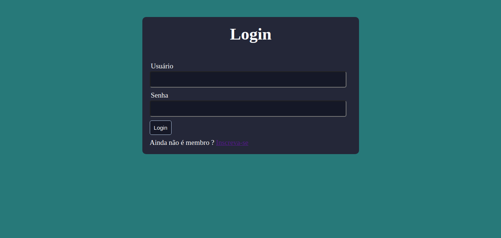
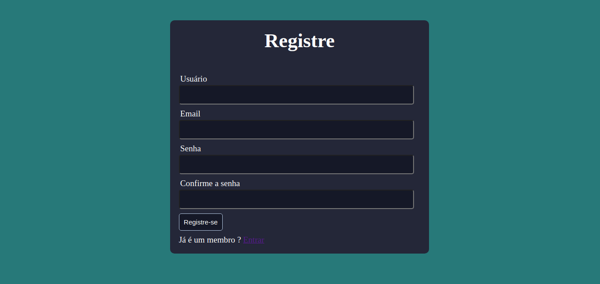
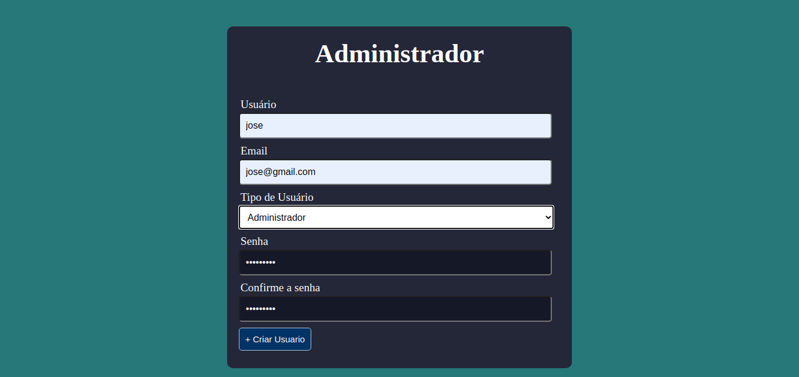
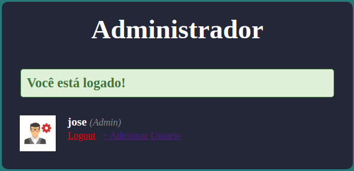
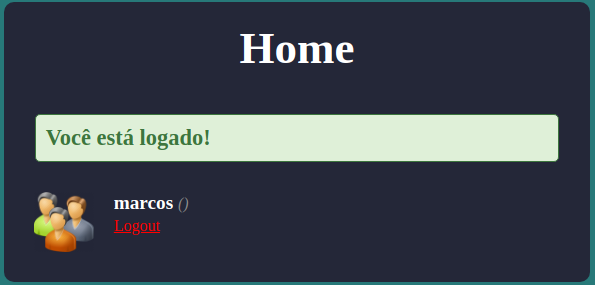

<h2 align="center">
  SISTEMA DE CADASTRO DE CONTROLE - ADMIN E USER
</h2>

<p>
  Este sistema realiza um cadastro básico, com o controle de quais usuários são administradores e não-administradores (usuário comum).
  Neste sistema, os usuários não-administradores não podem acessar página administrativa, todos os usuários (administradores e não-administradores), utilizam o mesmo formulário para realizarem o login.
  Após o login, os usuários comuns são redirecionados para a página home, enquanto os admistradores são redirecionados para a página de administrador.
</p>

<h4 align="left">
  Tela inicial para login de usuário.
</h4>



---

## Banco de dados
Crie um banco de dados e execute as instruções SQLs abaixo para criar a tabela `users`:

```
  CREATE TABLE users (
	 id int(11) not null auto_increment,
    usuario varchar(100) not null,
    email varchar(100) not null,
    senha varchar(50) not null,
    user_type varchar(50) not null,  
    primary key(id)
)
```
---

<h4 align="left">
  Caso o usuário ainda não possua cadastro, o mesmo é direcionado para tela de `Resgistre`.
</h4>



<h4 align="left">
  Tela para cadastro de usuário, neste caso somente o administrador tem acesso, com isso o mesmo poderá cadastrar um novo admin ou um usuário comum.
</h4>



<h4 align="left">
  Tela para cadastro de usuário, neste caso somente o administrador tem acesso, com isso o mesmo poderá cadastrar um novo admin ou um usuário comum.
</h4>

<h4 align="left">
  Ao finalizar o processo de cadastro, o sistema apresenta a tela de confirmação.
</h4>




---

## Tecnologias e ferramentas utilizadas
Para o desenvolvimento deste projeto utilizei:

- PHP 8.0.12
- MySQL 5.7
- phpMyAdmin 5.1.1
- Sublime Text 3